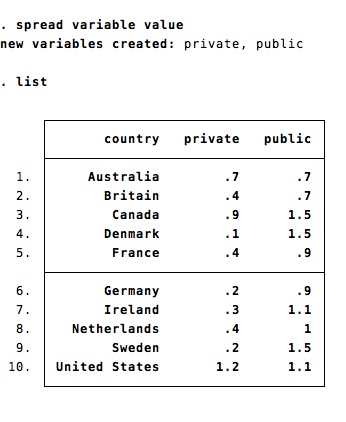

stata-tidy
===========

An implementation of the [tidyr](https://github.com/hadley/tidyr) functions gather and spread in Stata


- gather transforms a wide dataset into a long dataset. Just specify the varlist that need to be gathered


	```
	sysuse educ99gdp.dta, clear
	gather public private
	```
	


	
- spread transforms a long dataset into a wide dataset. The first variable is used to construct the names of the new variables. The second variable contains the value of the new variable.

	```
	spread variable value
	```
	

	-- If the first variable is a string, the values become the names of the new variables
	-- If the first variable is numeric, the new variables names are constructed as the name of the second variable followed by the numeric value. Value labels are transformed into variable labels.

	```
	sysuse educ99gdp.dta, clear
	gather public private
	egen g = group(variable), label
	drop variable
	spread g value
	```
